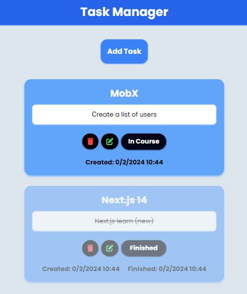
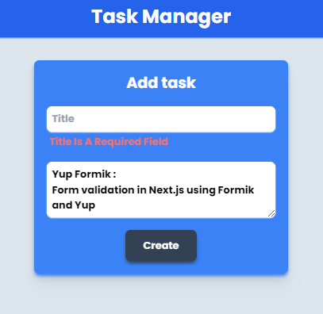
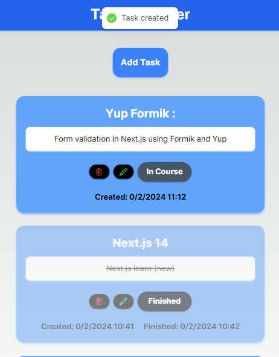

### 📸 learn-nextjs14-mobx




#### This template is created using six different MobX state manager examples for different use cases.
#### Showcasing the using MobX with react hooks.

-------------------------------------------------

### ⚙️ Technology Stack


-------------------------------------------------
### 📝 Local State management
Mobx data is stored in local storage.


-------------------------------------------------
### ‍💻 Getting Started
```bash
npm run dev
# or
yarn dev
```
-------------------------------------------------

## 📖 TODO
- Recycle knowledge and refresh mind
- < code />

### 🌐 Learn More

>This is a [Next.js](https://nextjs.org/)
